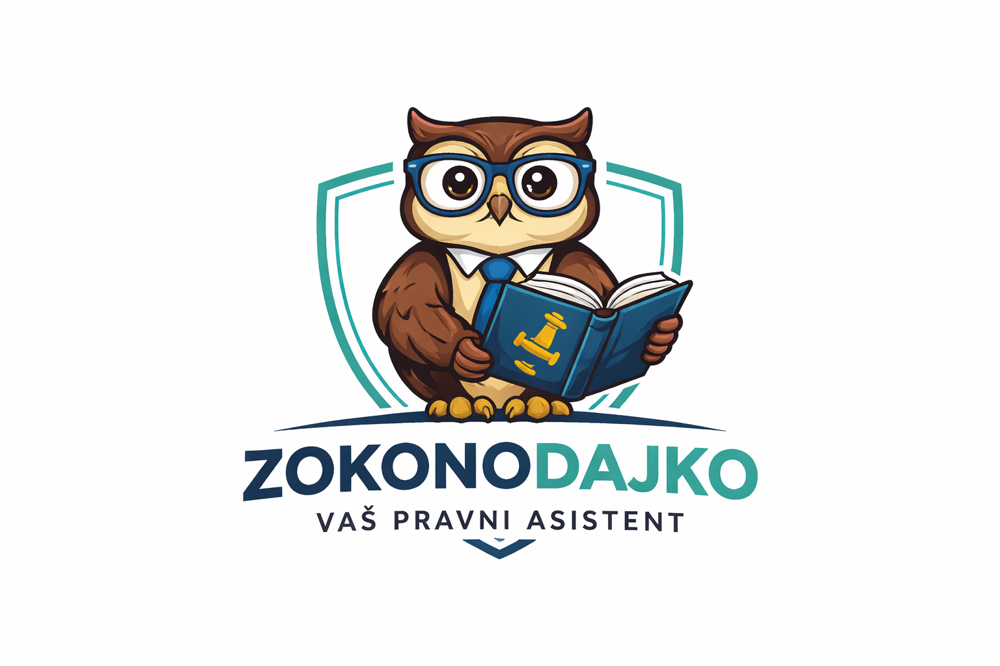

# Natural language processing course: `Zakonodajko`

## 🦉 Zokonodajko – Your Slovenian Legal AI Assistant

**Zokonodajko** is a domain-specific conversational AI assistant designed to provide accurate, context-aware answers about Slovenian legislation. Unlike general-purpose language models, Zokonodajko is grounded in curated legal sources, enabling it to deliver reliable and explainable responses with minimal hallucination.

---

## Purpose

Zokonodajko helps users navigate complex legal information by:

- answering questions about Slovenian laws (e.g., taxes, procedures, rights)
- explaining legal concepts in simple terms
- guiding users through administrative processes

---

## How it works

The system is built using a **Retrieval-Augmented Generation (RAG)** pipeline:

1. **User query understanding** – interprets the user’s intent  
2. **Document retrieval** – searches a curated legal knowledge base  
3. **Context injection** – provides relevant legal excerpts to the model  
4. **Answer generation** – produces grounded, explainable responses  

---

## Knowledge base

## 📚 Knowledge base

Zokonodajko relies on trusted Slovenian legal sources, including:

- Uradni list Republike Slovenije (official laws)
- Pravni informacijski sistem Republike Slovenije – primary legal texts:
  - **[Zakon o davku na dodano vrednost (ZDDV‑1)](https://pisrs.si/pregledPredpisa?id=ZAKO4701)** – the Value Added Tax law  
  - **[Zakon o dohodnini (ZDoh‑2)](https://pisrs.si/pregledPredpisa?id=ZAKO4697)** – the Income Tax Act  
  - **[Zakon o davčnem postopku (ZDavP‑2)](https://pisrs.si/pregledPredpisa?id=ZAKO4703)** – the Tax Procedure Act
- Finančna uprava Republike Slovenije (tax guidelines and explanations)
- GOV.SI (public service procedures)

---

## Example queries

- “What taxes does an s.p. pay in Slovenia?”  
- “When is the deadline for dohodnina?”  
- “What are my rights as a tenant?”  

---

## ⚠️ Disclaimer

Zokonodajko is an informational tool and does not replace professional legal advice.

---

## Project Structure

The project is organized as follows:

- **`images/`** – contains the Zokonodajko logo and other visual assets  
- **`code/`** – contains all scripts, notebooks, and code used to build the agent  
- **`dataset/`** – contains the Slovenian legal documents, PDFs, and processed text used for retrieval and embeddings
